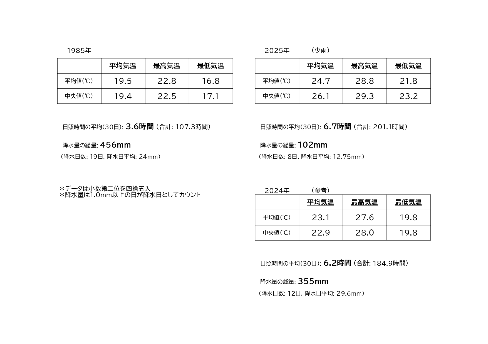

# 「夏」の印象の変化
中2

## はじめに
こんにちは。物理部員のh.kです。 
最近、「地球温暖化」が深刻になっているとニュースで聞きます。 
体育祭の6月初旬で30度を超える暑さで、日焼けもひどかった他とても疲れました。 
親世代の方々は、子供時代の頃より暑いと感じることもあるでしょう。(私の親もそうです。) 

昨今の夏が危険とされる理由はいくつかあり、 
　・夏の長期化  
　・命の関わる猛暑  
　・降水量の二極化  
降水量については、降る年はこれでもかというほど降り、川の氾濫などを起こすが、 
降らない年は農業にダメージを与えるほどの少雨になっているということです。

そこで、昔の夏はどうだったのかについて調べてみることにしました。 
40年前の1985年の天気と2025年の夏の天気で、湿度や気温、降水量などから比較していきたいと思います。 
天気情報は気象庁からの引用で、横浜地方気象台のデータを用います。 

データの比較において近年躍進中のAIを利用するのも手でしたが、 
執筆時点でハルシネーションや一部データの参照を飛ばすなど問題があるので、 
ここではAIは使用していません。

また、6月〜8月の天気を比較します。 
**1985年は当時では猛暑であることに留意してください。**

## 6月
「6月」といえば梅雨の時期。 
しとしと連日雨が降る季節...であるはずですが、近年は違うそうです。 

まずはこの表を見てください。 
2025年は少雨だったため、割と降った2024年の画像も提示しています。 

### 雨
ここには載せていませんが、2020年から2025年を見てみると、梅雨の雨量は年ごとに大きな差があります。 
あと、降水日数を見ると、1985年は半分以上の日が1.0mm以上降っていましたが、2024年は12日まで減少し、2025年は8日まで減っています。 
降水量も6月全体では減少傾向です。太平洋高気圧の張り出しが強いため雨が降りにくいと考えられます。 

また、2024年の降水日だけの降水量平均は1985年より高くなっています。 
なぜかというと、「土砂降り」の日が増えたからです。 
地球温暖化により海面からの水蒸気量が増えているからです。 
なにかしらで、冷やされ時に多量の雨を降らせるのは空に水蒸気がたくさんあるからです。

###
